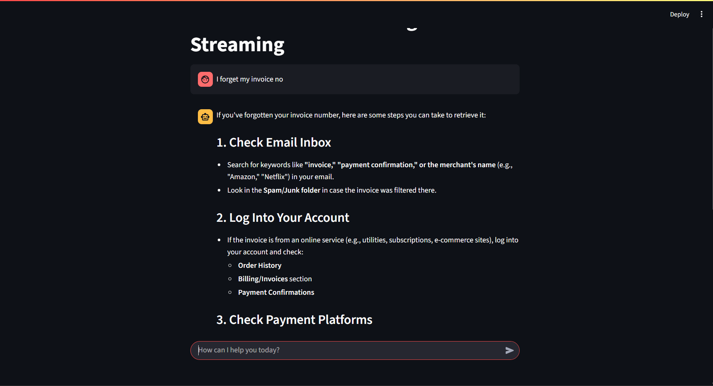

# 🤖 Rule-Based Decision Agent

A sophisticated customer service chatbot that combines rule-based decision making with AI-powered responses. The agent uses predefined if-then logic rules for common queries and falls back to DeepSeek R1 API via OpenRouter for complex questions, featuring real-time streaming responses.

## ✨ Features

- **🔍 Rule-Based Intelligence**: Instant responses for common customer service queries
- **🧠 AI Fallback**: DeepSeek R1 integration for complex questions via OpenRouter
- **⚡ Real-Time Streaming**: Token-by-token response streaming using LangChain
- **🖥️ Dual Interface**: Command-line and Streamlit web application
- **📊 State Management**: Session-based conversation tracking
- **🎯 Smart Routing**: Automatic classification between rules and AI responses

## 🏗️ Project Architecture

```
Rule-Based-Decision-Agent/
├── main.py                    # CLI entry point with streaming
├── Streamlit.py              # Web interface with real-time chat
├── .env                      # Environment variables
├── .env.example             # Environment template
├── agent/
│   ├── __init__.py
│   ├── rules.py             # If-then rule definitions
│   ├── state_manager.py     # Session state management
│   ├── deepseek.py          # Direct API client (legacy)
│   └── langchain_deepseek.py # LangChain streaming client
└── Documentation/
    ├── Readme.md            # This file
    └── requirements.txt     # Dependencies
```

## 🚀 Quick Start

### Prerequisites

- Python 3.8+
- OpenRouter API Key (for DeepSeek R1 access)
- Git (optional)

### Installation

1. **Clone the repository**

```bash
git clone <repository-url>
cd Rule-Based-Decision-Agent
```

2. **Install dependencies**

```bash
pip install -r Documentation/requirements.txt
```

3. **Set up environment variables**

```bash
# Copy the example environment file
cp .env.example .env

# Edit .env and add your OpenRouter API key
API_KEY=your_openrouter_api_key_here
```

4. **Get OpenRouter API Key**
   - Visit [OpenRouter](https://openrouter.ai/)
   - Create an account and generate an API key
   - Copy the key to your `.env` file

## 💻 Usage

### Command Line Interface

Run the agent in terminal with streaming responses:

```bash
python main.py
```

**Example interactions:**

```
User: hello
Agent: Hello! How can I assist you today?

User: I have an order issue
Agent: I see you have an inquiry about an order. Could you please provide the order number?

User: How do I reset my password?
Agent: [Streaming AI response from DeepSeek R1...]
```

### Streamlit Web Interface

Launch the interactive web application:

```bash
streamlit run Streamlit.py
```

Open your browser to `http://localhost:8501` for the chat interface.

## 📋 Screenshots

### Streamlit Web Interface


_Real-time chat interface with streaming responses_

### Command Line Interface


_Terminal-based interaction with token streaming_

## 🔧 How It Works

### Decision Flow

1. **User Input** → Rule engine checks for keyword matches
2. **Rule Match** → Returns predefined response instantly
3. **No Match** → Triggers DeepSeek R1 API call via LangChain
4. **Streaming Response** → Displays tokens in real-time

### Rule Categories

| Category  | Keywords                        | Example Response                              |
| --------- | ------------------------------- | --------------------------------------------- |
| Greetings | `hello`, `hi`, `greetings`      | "Hello! How can I assist you today?"          |
| Orders    | `orders`, `purchase`, `buy`     | "Could you please provide the order number?"  |
| Issues    | `complaint`, `issue`, `problem` | "Could you tell me more about the issue?"     |
| Refunds   | `refund`, `return`              | "Let's work on getting that sorted out."      |
| Thanks    | `thank`, `thanks`               | "Is there anything else I can help you with?" |

### State Management

```python
# Session initialization
state_manager.initialize_state("session1")

# State transitions
state_manager.update_state("session1", "PROCESSING_ORDER")
current_state = state_manager.get_state("session1")
```

## 🛠️ Configuration

### Model Settings

Default configuration in `langchain_deepseek.py`:

- **Model**: `deepseek/deepseek-r1:free`
- **Streaming**: Enabled
- **API Base**: `https://openrouter.ai/api/v1`

### Adding New Rules

Update the `rules` list in `agent/rules.py`:

```python
self.rules = [
    (["new_keyword", "another_keyword"], "Your custom response here"),
    # ... existing rules
]
```

### Environment Variables

| Variable  | Description                            | Required |
| --------- | -------------------------------------- | -------- |
| `API_KEY` | OpenRouter API key for DeepSeek access | Yes      |

## 📦 Dependencies

- `langchain-openai` - LangChain OpenAI integration
- `langchain-community` - Community LangChain components
- `python-dotenv` - Environment variable management
- `streamlit` - Web application framework

## 🏆 Learning Outcomes

This project demonstrates:

- **Control Flow**: If-then logic implementation
- **State Machines**: Session management patterns
- **Agent Architecture**: Hybrid rule-based and AI systems
- **Streaming APIs**: Real-time response handling
- **UI Development**: Both CLI and web interfaces

## 🔍 API Integration

### DeepSeek R1 via OpenRouter

```python
# Direct API call (legacy)
client = DeepSeekClient(api_key)
response = client.get_completion(messages)

# LangChain streaming (current)
client = LangChainDeepSeekClient(api_key)
for chunk in client.get_completion_streaming_generator(messages):
    print(chunk, end="", flush=True)
```

## 🚧 Error Handling

- **API Failures**: Graceful fallback messages
- **Invalid Keys**: Clear error messages
- **Network Issues**: Timeout handling
- **Empty Responses**: Default fallback text

## 🤝 Contributing

1. Fork the repository
2. Create a feature branch (`git checkout -b feature/amazing-feature`)
3. Commit your changes (`git commit -m 'Add amazing feature'`)
4. Push to the branch (`git push origin feature/amazing-feature`)
5. Open a Pull Request

## 📝 License

This project is open source and available under the [MIT License](LICENSE).

## 🙏 Acknowledgments

- **DeepSeek** for the powerful R1 language model
- **OpenRouter** for API access and routing
- **LangChain** for streaming capabilities
- **Streamlit** for the excellent web framework

## 📞 Support

If you encounter any issues:

1. Check your API key is correctly set in `.env`
2. Verify OpenRouter account has sufficient credits
3. Review the [Issues](../../issues) section
4. Create a new issue with error details

## 🎯 Future Enhancements

- [ ] Multi-language support
- [ ] Advanced state management with conversation memory
- [ ] Custom rule builder UI
- [ ] Analytics dashboard
- [ ] Voice input/output capabilities
- [ ] Integration with popular helpdesk systems

---

**Made with ❤️ using DeepSeek R1 and LangChain**

_Experience intelligent customer service automation with real-time AI responses_
