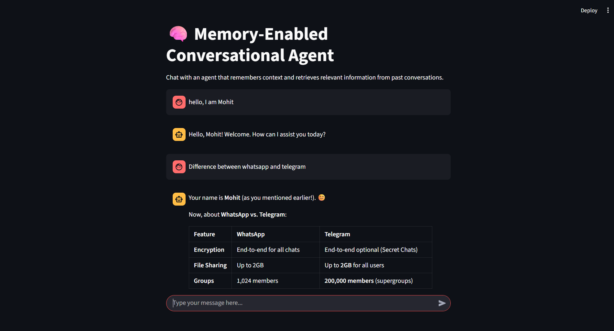

# 🧠 Memory-Enabled Conversational Agent

A context-aware chatbot that remembers your conversation history, retrieves relevant information, and generates intelligent responses using Retrieval Augmented Generation (RAG) and LLMs via DeepSeek (OpenRouter). This project demonstrates practical memory systems, vector database usage, and embeddings in conversational AI.

---

## 🚀 Features

- **Conversation Memory:** Remembers all messages in a session for context-aware replies.
- **Vector Database Integration:** Stores and retrieves conversation snippets using ChromaDB.
- **Embeddings:** Uses Sentence Transformers to encode and search messages.
- **Basic RAG Pipeline:** Augments LLM prompts with retrieved context for smarter answers.
- **LLM-Powered Responses:** Connects to DeepSeek via OpenRouter API for natural language generation.
- **Streamlit Frontend:** Chat with your agent in a modern web UI.
- **CLI Interface:** Interact with the agent in your terminal.

---

## 📁 Project Structure

```
03_Memory-Enabled-ConverSational-agent/
├── .env                      # API keys and environment variables
├── main.py                   # CLI entrypoint
├── streamlit.py              # Streamlit web UI
├── concept.txt               # Project concept and flow
├── agent/
│   ├── __init__.py
│   ├── deepseek.py           # DeepSeek/OpenRouter LLM client
│   ├── memory.py             # Conversation memory manager
│   ├── rag.py                # RAG pipeline (embeddings + retrieval)
│   ├── state_manager.py      # Session state management
├── Documentation/
│   ├── Readme.md             # This file
│   ├── requirements.txt      # Python dependencies
├── screenshots/              # UI screenshots
```

---

## ⚡ Installation & Setup

1. **Clone the repository**
    ```bash
    git clone https://github.com/devwithmohit/Agentic-Ai.git
    cd Agentic-Ai-Projects/03_Memory-Enabled-ConverSational-agent
    ```

2. **Install dependencies**
    ```bash
    pip install -r Documentation/requirements.txt
    ```

3. **Configure environment variables**
    - Copy `.env.example` to `.env` and add your OpenRouter API key:
      ```
      API_KEY=your_openrouter_api_key_here
      ```

---

## 💻 Usage

### Command Line Interface

```bash
python main.py
```
- Type your messages and get context-aware responses.
- Type `exit` or `bye` to end the session.

### Streamlit Web Interface

```bash
streamlit run streamlit.py
```
- Chat with your agent in the browser.
- The agent remembers your conversation and retrieves relevant info for each reply.

---

## 🗂️ How It Works

1. **Session starts:** StateManager initializes session state.
2. **User sends message:** Message is stored in ConversationMemory and indexed in ChromaDB.
3. **RAG pipeline:** RAGRetriever finds relevant context from memory using embeddings.
4. **Prompt augmentation:** Retrieved context is combined with the user query.
5. **LLM response:** DeepSeekClient sends the prompt to DeepSeek via OpenRouter and returns the answer.
6. **Memory update:** Assistant’s reply is stored for future context.

---

## 🏞️ Screenshots

Add screenshots to the `screenshots/` folder and reference them here:

### Streamlit Chat UI


---

## 🛠️ Configuration

- **Embedding Model:** Uses `all-MiniLM-L6-v2` by default (changeable in `rag.py`).
- **Vector DB:** Uses ChromaDB (can be swapped for Pinecone).
- **LLM Model:** Uses DeepSeek via OpenRouter (model name configurable in `deepseek.py`).

---

## 🎯 Learning Outcomes

- How to build memory-enabled conversational agents
- Using vector databases for context retrieval
- Working with embeddings and RAG pipelines
- Integrating LLMs for natural language responses
- Building modern chat UIs with Streamlit

---

## 🤝 Contributing

Contributions are welcome!  
- Fork the repo and create a feature branch.
- Add new features, improve docs, or fix bugs.
- Submit a pull request with a clear description.

---

## 📄 License & Credits

- **License:** MIT (see LICENSE file)
- **Credits:** Thanks to the open-source AI community, Hugging Face, ChromaDB, DeepSeek, and Streamlit.

---

**Build smarter, context-aware chatbots with memory and