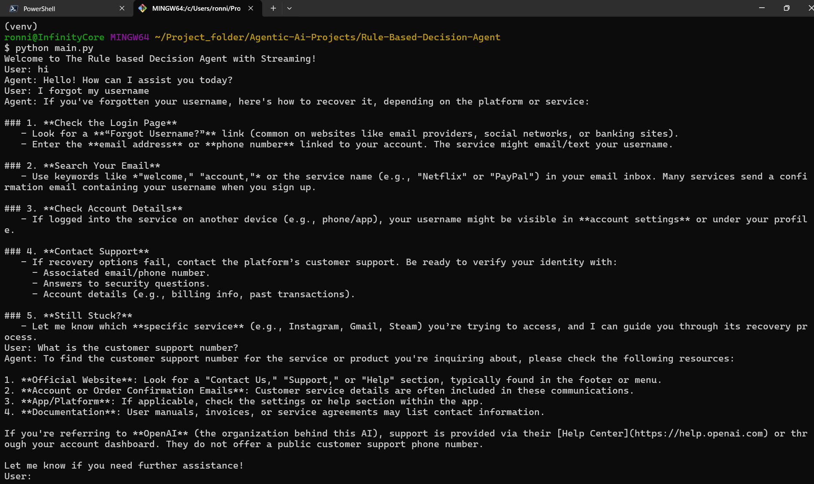

# 🚀 Agentic AI Projects Repository

[](LICENSE)
[](https://www.python.org/)
[](#contributing)

---

## 🧠 What is Agentic AI?

**Agentic AI** refers to artificial intelligence systems designed to act as autonomous agents. These agents can reason, plan, remember, and collaborate—often powered by large language models (LLMs) and advanced workflows.  
Agentic AI goes beyond simple question-answering: it enables systems to make decisions, maintain context, and interact intelligently with users and other agents.

---

## 🎯 Repository Purpose

This repository is a curated **learning path** and **project collection** for anyone interested in building practical Agentic AI systems.  
Projects are organized by difficulty level, so you can start with the basics and progress to advanced multi-agent architectures.

---

## 📚 Repository Structure

Projects are grouped by difficulty level:

| Level         | Folder Name                              | Description                                  |
|---------------|-----------------------------------------|----------------------------------------------|
| Foundation    | `01_Simple-task-executor-Agent`         | Beginner-friendly agentic AI projects        |
|  Foundation | `02_Rule-Based-Decision-Agent`          | More complex agents with rule-based logic    |
| Intermediate      | `03_Memory-Enabled-CoverSational-agent` | Agents with memory, context, and RAG         |

> **Note:** More intermediate and advanced projects will be added soon!


---

## ⚡ Installation & Setup

1. **Clone the repository**
    ```bash
    git clone https://github.com/devwithmohit/Agentic-Ai-Projects.git
    cd Agentic-Ai-Projects
    ```

2. **Install dependencies for a project**
    ```bash
    cd <project-folder>
    pip install -r Documentation/requirements.txt
    ```

3. **Set up environment variables**
    - Copy `.env.example` to `.env` and add your API keys as needed.

4. **Run the project**
    - For CLI:
        ```bash
        python main.py
        ```
    - For Streamlit UI:
        ```bash
        streamlit run Streamlit.py
        ```

---

## 🚀 How to Use

- **Explore Projects:**  
  Each folder contains a self-contained agentic AI project with its own README and documentation.  
  Start with the Foundation level and progress as you learn.

- **Try Out Demos:**  
  Run CLI or Streamlit interfaces to interact with agents.

- **Learn by Example:**  
  Review code, experiment with parameters, and extend functionality.

- **Contribute:**  
  See Contributing below for how to add your own projects or improve existing ones.

---

## 🗺️ Future Roadmap

- **Intermediate Level:**  
  - More advanced rule-based agents  
  - Agents with multi-turn reasoning  
  - Integration with external APIs

- **Advanced Level:**  
  - Memory-enabled agents using vector databases (Pinecone/Chroma)  
  - Retrieval Augmented Generation (RAG)  
  - Multi-agent collaboration and planning  
  - Advanced context management

---

## 🤝 Contributing

We welcome contributions from everyone!  
To contribute:

1. **Fork the repository**
2. **Create a feature branch**
    ```bash
    git checkout -b feature/my-new-agent
    ```
3. **Add your code or improvements**
4. **Commit and push**
    ```bash
    git add .
    git commit -m "feat: add new agent project"
    git push origin feature/my-new-agent
    ```
5. **Open a Pull Request**  
   Describe your changes and link to any relevant issues.

**Contribution ideas:**
- New agentic AI projects
- Documentation improvements
- Bug fixes and optimizations
- Tutorials and example notebooks

---

## 📄 License & Credits

- **License:**  
  This repository is open source under the MIT License.

- **Credits:**  
  Thanks to the open-source AI community and contributors for inspiration and support.

---

##  Screenshots

Below are sample screenshots from included projects:

### Simple Task Executor Agent (Streamlit UI)


### Rule-Based Decision Agent (CLI)


### Memory-Enabled Conversational Agent (Streamlit UI)


---

**Start your journey in Agentic AI—explore, learn, and